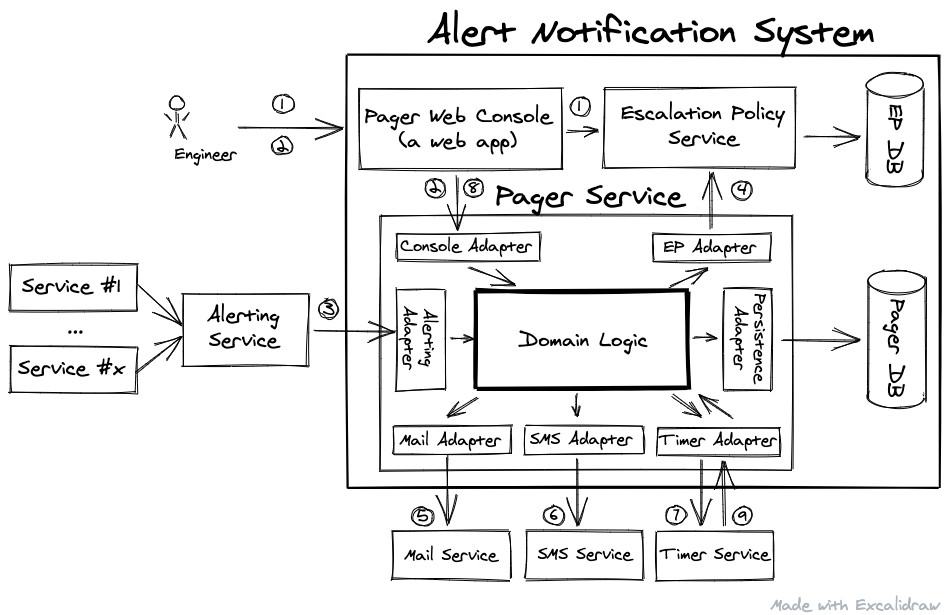

# PHP - concept proof for an Alert Notification System
The implement an in-house alert notification system with the architecture:



# Installation in ubuntu:
Install php version 7.1
```
sudo apt-add-repository ppa:ondrej/php
sudo apt-get install php7.1 php7.1-common php7.1-cli php7.1-mbstring php7.1-curl php7.1-xdebug
sudo update-alternatives --set php /usr/bin/php7.1
```
Or use a docker image: 
```angular2html
docker pull phpstorm/php-71-apache-xdebug
```
Install dependencies (this command must create vendor dir):
```
./bin/composer.phar install 
```
Generate autoload files in case of errors like "Class not found":
```
 ./bin/composer.phar dumpautoload -o
```
Run tests: 
```
./bin/behat 
./bin/phpunit tests/
```
